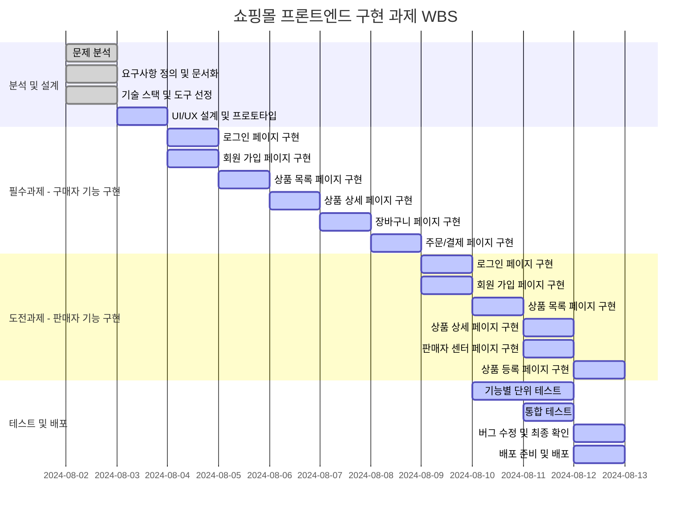

# 오픈 마켓 프론트엔드 구현 과제

## 문제 분석

### 요구 사항 분석

- **쇼핑몰의 기능과 요구 사항을 명확히 정의**:
  - 구매자 기능: 로그인, 회원 가입, 상품 목록, 상품 상세, 장바구니, 주문/결제
  - 판매자 기능: 로그인, 회원 가입, 상품 목록, 상품 상세, 판매자 센터, 상품 등록
- **사용자 인터페이스(UI)와 사용자 경험(UX)에 대한 기대 사항 파악**:
  - 직관적이고 사용하기 쉬운 인터페이스
  - 반응형 디자인으로 다양한 디바이스에서 접근 가능
- **백엔드 API의 기능 및 사용 방법 이해**:
  - 사용자 인증 API
  - 상품 목록 및 상세 정보 API
  - 장바구니 및 주문 API
  - 판매자 관련 API

### 기능 목록 도출

1. **구매자 기능**:

   - 로그인 페이지
   - 회원 가입 페이지
   - 상품 목록 페이지
   - 상품 상세 페이지
   - 장바구니 페이지
   - 주문/결제 페이지

2. **판매자 기능**:
   - 로그인 페이지
   - 회원 가입 페이지
   - 상품 목록 페이지
   - 상품 상세 페이지
   - 판매자 센터 페이지
   - 상품 등록 페이지

### 기술 스택 결정

- **프론트엔드 프레임워크/라이브러리 선택**:
  - JS
  - vite
- **스타일링 도구**:
  - CSS

### 기술적 과제 및 해결 방안

- **백엔드 API와의 통신**:
  - Axios 라이브러리 사용
- **반응형 디자인 구현**:
  - Media queries와 Flexbox/Grid 사용
- **SPA 구현**:
  - JS로 직접 DOM 조작하여 SPA 구현

### 일정 관리 및 배포 계획

- **각 기능 구현에 필요한 예상 시간 산출**:

  - 로그인 페이지: 0.5일
  - 회원 가입 페이지: 0.5일
  - 상품 목록 페이지: 1일
  - 상품 상세 페이지: 1일
  - 장바구니 페이지: 1일
  - 주문/결제 페이지: 1일
  - 판매자 로그인 페이지: 0.5일
  - 판매자 회원 가입 페이지: 0.5일
  - 판매자 상품 목록 페이지: 1일
  - 판매자 상품 상세 페이지: 0.5일
  - 판매자 센터 페이지: 0.5일
  - 상품 등록 페이지: 1일

- **버전 관리 및 배포 전략 수립**:
  - Git을 이용한 버전 관리

